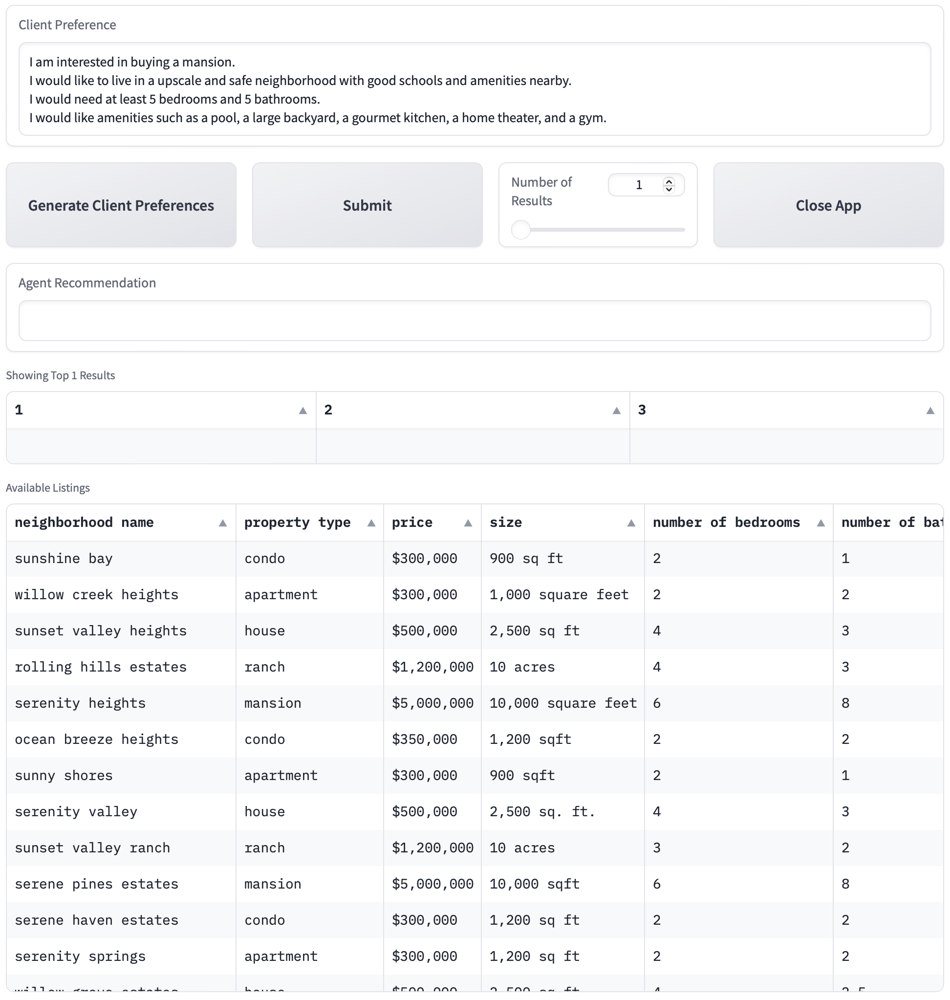

# llm-personalized-real-estate-agent
## This is the capstone project for Udacity Genarative AI Nano Degree 
Imagine you're a talented developer at "Future Homes Realty", a forward-thinking real estate company. In an industry where personalization is key to customer satisfaction, your company wants to revolutionize how clients interact with real estate listings. The goal is to create a personalized experience for each buyer, making the property search process more engaging and tailored to individual preferences.
## The Challenge
Your task is to develop an innovative application named "HomeMatch". This application leverages large language models (LLMs) and vector databases to transform standard real estate listings into personalized narratives that resonate with potential buyers' unique preferences and needs.

## Core Components of "HomeMatch"
### Understanding Buyer Preferences:
Buyers will input their requirements and preferences, such as location, property type, budget, amenities, and lifestyle choices.
The application uses LLMs to interpret these inputs in natural language, understanding nuanced requests beyond basic filters.
### Integrating with a Vector Database:
Connect with a vector database (lanceDB), where all available property listings are stored.
Utilize vector embeddings to match properties with buyer preferences, focusing on aspects like neighborhood vibes, architectural styles, and proximity to specific amenities.
### Personalized Listing Description Generation:
For each matched listing, use an LLM to rewrite the description in a way that highlights aspects most relevant to the buyer’s preferences.
Ensure personalization emphasizes characteristics appealing to the buyer without altering factual information about the property.
### Listing Presentation:
Output the personalized listing(s) as a text description of the listing.

## Package requirements
```
numpy version: 1.26.4
pandas version: 2.2.1
openai version: 1.16.2
lancedb version: 0.6.7
gradio version: 4.24.0
```

# Installation:
## Clone the repository into a direcotry
```bash
cd ~/user-defined-directory/
```

### HTTPS
```bash
git clone https://github.com/wcy41gtc/llm-personalized-real-estate-agent.git
```
### SSH
```bash
git clone git@github.com:wcy41gtc/llm-personalized-real-estate-agent.git
```
#### Creating a virtual environment is highly recommended for the project

## Install required packages
### pip
```bash
pip install -r requirements.txt
```

### conda

```bash
conda env create -f requirements.yaml
```
### activate the virtual environment
```bash
source ~VitualEnv/bin/activate
```
```bash
conda activate VitualEnv
```
##### VitualEnv is the name of the virtual environment
# OpenAI API key
copy and past your OpenAI API key into a .txt file and save it in the project directory as openai_api_key.txt

# Running the app
```bash
python3 HomeMatch.py
```
The following message should appear:
```
Reading listings from pre-generated file...
Reading successfull.
Creating lanceDB vector database...
Database creation successful.
Starting Gradio app...
Running on local URL:  http://127.0.0.1:7861

To create a public link, set `share=True` in `launch()`.
```
click the URL to access the user interface:


# Usage
1. A client preference is pre-poupulated in the top textbox.
2. Click [submit] button to search for a recommendation, an AI tailored description of the recommendation will be shown in the [Agent Recommendation] textbox.
3. Click [Generate Client Preferences] to randomly generate another client preference.
4. Adjust [Number of Results] to generate more different number of recommendations.

# Contributor
Chaoyi Wang (wcy41gtc), April 14, 2024


